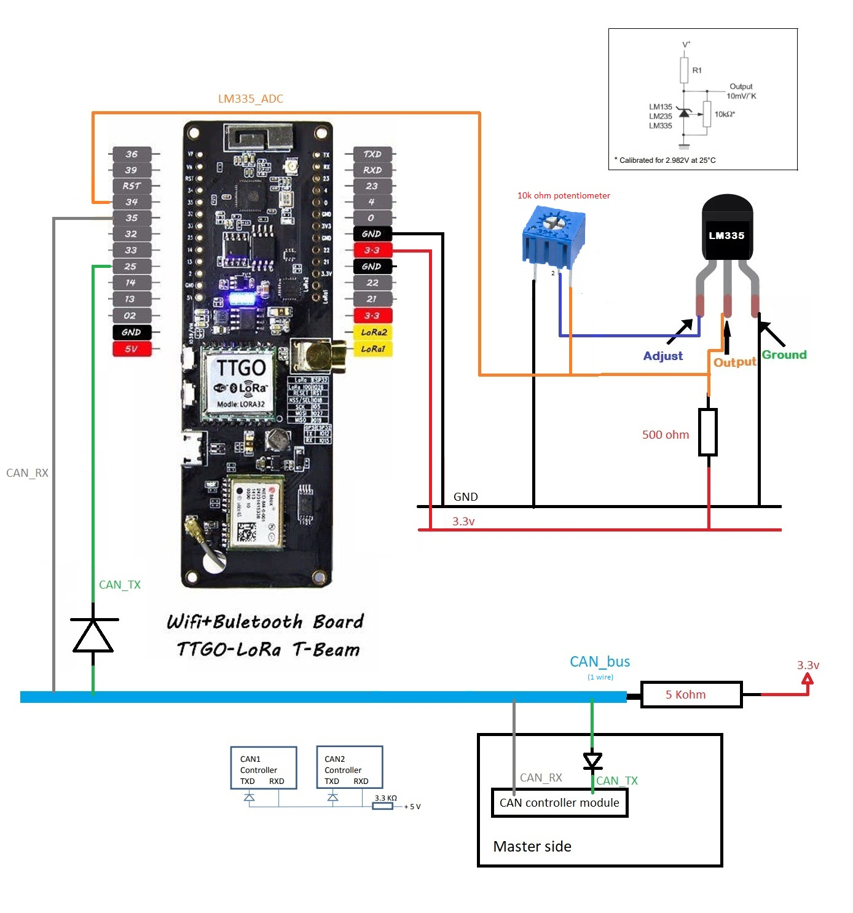

# TemperatureSensor_CAN_ESP32


### Description

Temperature sensor device uses CAN protocol build in TTGO ESP32 T-Beam dev board to send tempearature measurements.

### Platform

- Board: TTGO T-Beam
- SoC microcontroller: ESP32
- Framwork: Arduino
- Dependencies: CAN library from sandeepmistry/CAN

### How it works

> Data acquasition:

1. Device read ADC value from LM335 100 time (lasts for 1 second).
2. Filter ADC value.
3. Calculate Temperature measurement from ADC value and convert it to °C. `ADC -> mV -> °K -> °C`

> Send Data:

4. Prapare payload:
    
    + Scale temperature value by 100 to keep 2 digits precision.
    + Store data in correct place in payload (Byte 2 and byte 3 of payload).

5. Prapare frame to send it to CAN bus.
    
    + Store device ID in CAN packer
    + Store payload in CAN packet

6. Send Data

> Duty cycle

Device will keep sending measurements every second.

### Schematic


### Preparation
It's recommanded to calibrate the LM335 Sensor by adjusting the potentiometer until you get the correct temperature. To make it easy, the device already prints (via UART) the tempearature value.

```
Serial.printf("iTempDegital=%d | TempRaw mV= %.3f | Temp K = %.3f | Temp C = %.3f\n", iTempDegital, fTempRaw, fTempRaw/10, (fTempRaw/10)-273.15);
```

### Reference
CAN bus without transceiver module, check Page 4 **A Tiny Network without Transceiver ICs**. [PDF link](<doc/references/siemens_AP2921.pdf>)

[LM335 Datasheet](<doc/references/lm335 datasheet.pdf>)

## Note
The project is still in progress and certainly few paramaters like duty cycle and send on request will be configurable.